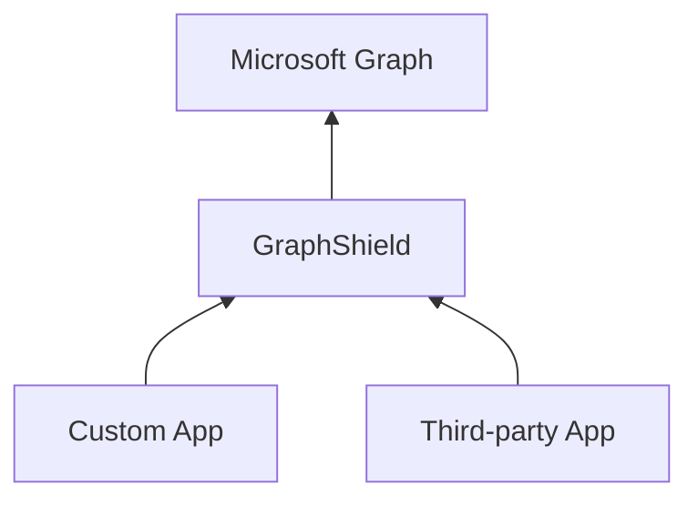
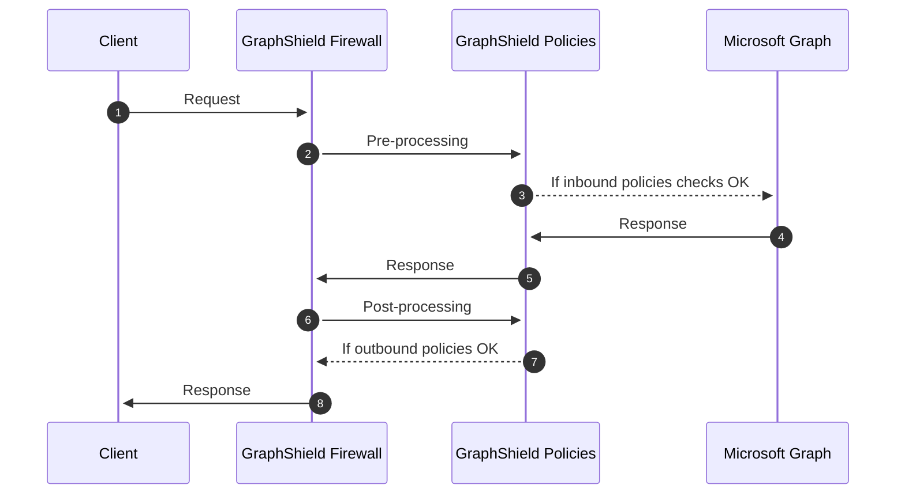

# How does it Work?

**ABSTRACT**
From a logical standpoint, GraphShield acts as a firewall that stands between your custom and third-party SAAS apps and the Microsoft Graph.



## How GraphShield Handles Transactions
Once a request is received to `microsoftgraph.graphshield.app` from a client app, it passes through a serie of middlewares, that could control access to the Microsoft Graph resources (pre-processing "inbound" policies), and alter the response from the Microsoft Graph (post-processing "outbound" policies):



## GraphShield understands the Microsoft Graph
Contrary to a regular firewall or even an application reverse proxy, GraphShield "understands" Microsoft Graph requests and responses.  
GraphShield implements a set of intelligent policies and rules that process requests and responses so that it has **zero impact** on third-party apps.

For instance, here is the result of a user profile ( ``` /me ``` ) query protected by our PII masking policy.

``` json
{
    "@odata.context": "https://graph.microsoft.com/v1.0/$metadata#users/$entity",
    "displayName": "###-REDACTED-PERSON-###",
    "userPrincipalName": "###-REDACTED-EMAIL-###"
    ...
}
```

Similarly, here is the result of a teams ( ``` /me/joinedTeams ``` ) query protected by our classification masking policy. Note that some teams from the ```value``` property are dynamically hidden based on their classification level, and that the ```@odata.count``` property is updated accordingly.

``` json
{
    "@odata.context": "https://graph.microsoft.com/v1.0/$metadata#teams",
    "@odata.count": 23,
    "value": [
        {
            "id": "team-id",
            "displayName": "team-display-name",
            ...
        }
        ...
```

Finally, here is the result of a teams ( ``` /teams/{id} ``` ) query protected by our classification masking policy. Note that the response HTTP status code will be ```403```, and that the response object respects the Microsoft Graph error JSON format. Learn more about [GraphShield errors](./errors).

``` json
{
  "error": {
    "code": "classifiedGroup",
    "message": "Middleware io.graphshield.rules.hide-classified-groups.parse-response-body: This group is classified and cannot be retreived.",
    "innerError": {
      "requestId": "request-id",
      "date": "date-time"
    }
  }
}
```
