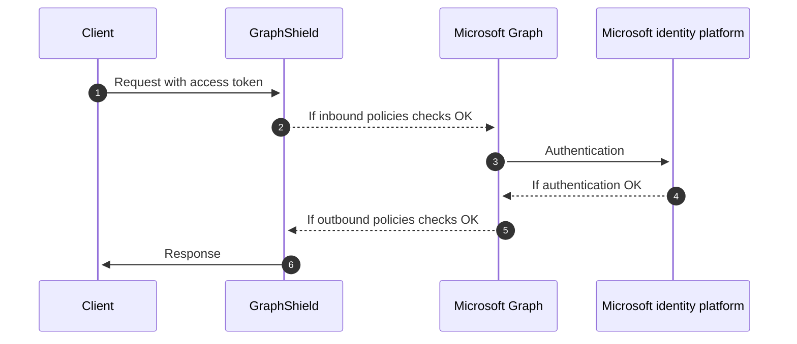
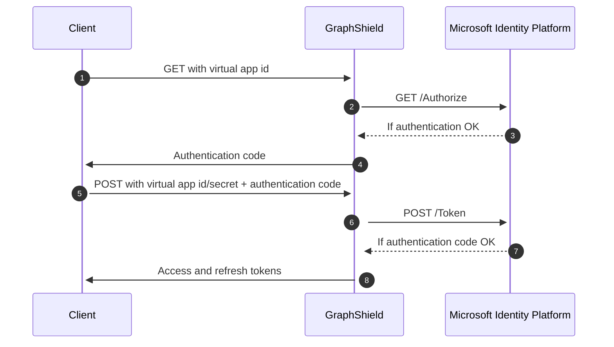
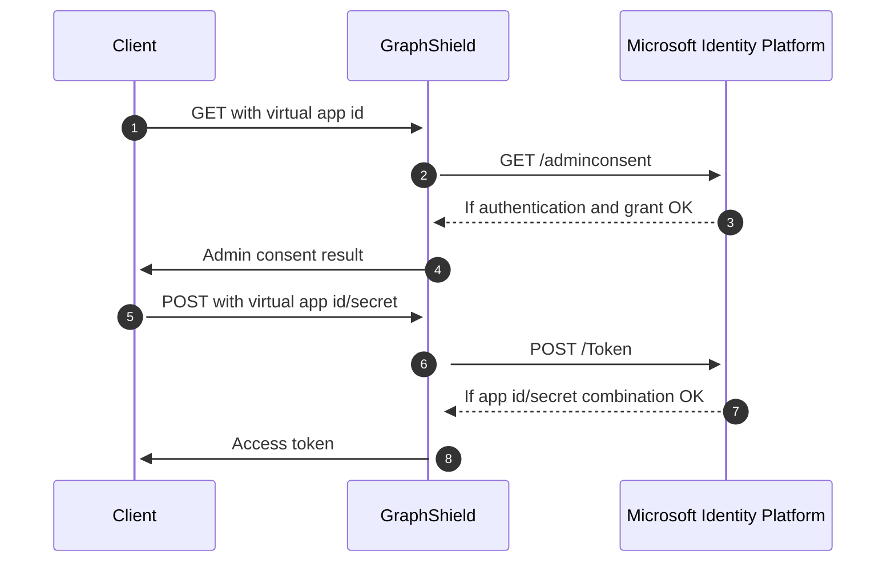

# Authentication
> GraphShield was designed so that it interfere as less as possible with your authentication process.

## Abstract
GraphShield supports two modes of authentication, `Standard` and `Hardened`.

!!! tip
    - The `Standard` mode is perfect to use GraphShield without any additional constraints.  
    - The `Hardened` mode may be required when you're dealing with a strictly controlled Microsoft 365 environment.

### Standard mode
In standard mode, to call the Microsoft Graph API through GraphShield, your application just need to acquire a regular OAuth 2.0 Access token from the Microsoft Identity Platform, and present it in either of the following:
- The HTTP `Authorization` request header, as a `Bearer` token
- The graph client constructor, when using a Microsoft Graph client library

It means that in standard mode, **GraphShield is completely transparent regarding your authentication process**, as you're dealing directly with the Microsoft Identity Platform. Therefore you can refer to the standard [Microsoft Graph auth overview](https://docs.microsoft.com/en-us/graph/auth/) for reference to understand how to acquire an access token.

### Hardened mode
To cope with advanced security and compliance requirements in certain Microsoft 365 environments, GraphShield offers an additional layer of security for Microsoft 365 organizations through the concept of "Virtual Tokens".

**Virtual Tokens prevents apps from directly accessing real application id and secrets, bringing an additional layer of security by completely preventing an app to be able to bypass GraphShield and to make direct requests to the Microsoft Graph.**

With GraphShield, they are only two differences with the regular flow:
- You're calling `https://microsoftidentity.graphshield.app` instead of the regular `https://login.microsoftonline.com` URLs.
- You're passing a virtual app id and a virtual app secret instead of the real one. These app id and secret are verified then dynamically substituted by the real one during the proxying process.

We're currently supporting virtual tokens in these two main scenarios, that should cover 99% of the situations:
- Access on behalf of a user: Used by **single page apps**, **web apps**, and **natively installed apps**
- Access without a user: Used for **server-to-server** interactions that must run in the background

!!! warning Other OAuth 2.0 and OpenID protocols
    If you need to use other protocols, such as `OAuth 2.0 on-behalf-of flow` or `OAuth 2.0 device code flow`, just [contact us](https://www.graphshield.io/#contact).

#### Access on behalf of a user
The [OAuth 2.0 authorization code flow](https://docs.microsoft.com/en-us/azure/active-directory/develop/v2-oauth2-auth-code-flow) is described in [section 4.1 of the OAuth 2.0 specification](https://tools.ietf.org/html/rfc6749). It's used to perform authentication and authorization in the majority of app types, including single page apps, web apps, and natively installed apps. The flow enables apps to securely acquire access_tokens that can be used to access resources secured by the Microsoft identity platform, as well as refresh tokens to get additional access_tokens, and ID tokens for the signed in user.

By using GraphShield, the resulting process is completely transparent and does not impact your app:

!!! warning Using a national environment? (US, DE, CN...)
    See [Using a specific Microsoft Identity Platform environment](#using-a-microsoft-identity-platform-national-environment) if required.

#### Access without a user
You can use the [OAuth 2.0 client credentials grant](https://docs.microsoft.com/en-us/azure/active-directory/develop/v2-oauth2-client-creds-grant-flow) specified in [RFC 6749](https://tools.ietf.org/html/rfc6749#section-4.4), sometimes called "two-legged OAuth", to access web-hosted resources by using the identity of an application. This type of grant is commonly used for server-to-server interactions that must run in the background, without immediate interaction with a user. These types of applications are often referred to as daemons or service accounts.

By using GraphShield, the resulting process is completely transparent and does not impact your app:

!!! warning
    Using a national environment? (US, DE, CN...)

    See [Using a specific Microsoft Identity Platform environment](#using-a-microsoft-identity-platform-national-environment) if required.

## Using a Microsoft Identity Platform national environment
The Microsoft Identity Platform is available from different environments, and you have to use a different URL for each of them, for instance:
- Azure AD for US Government: `https://login.microsoftonline.us`
- Azure AD Germany: `https://login.microsoftonline.de`
- Azure AD China operated by 21Vianet: `https://login.chinacloudapi.cn`

See [Token service root endpoints](https://docs.microsoft.com/en-us/graph/deployments#app-registration-and-token-service-root-endpoints) for reference.

If you're in the situation where you need to access one of these specific Microsoft Identity Platform environments, just [contact us](https://www.graphshield.io/#contact).
