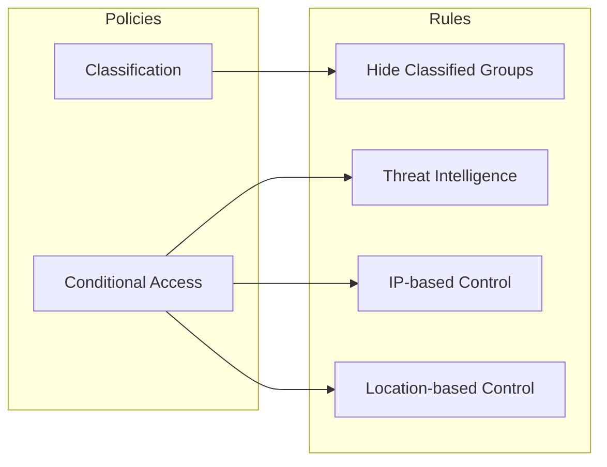
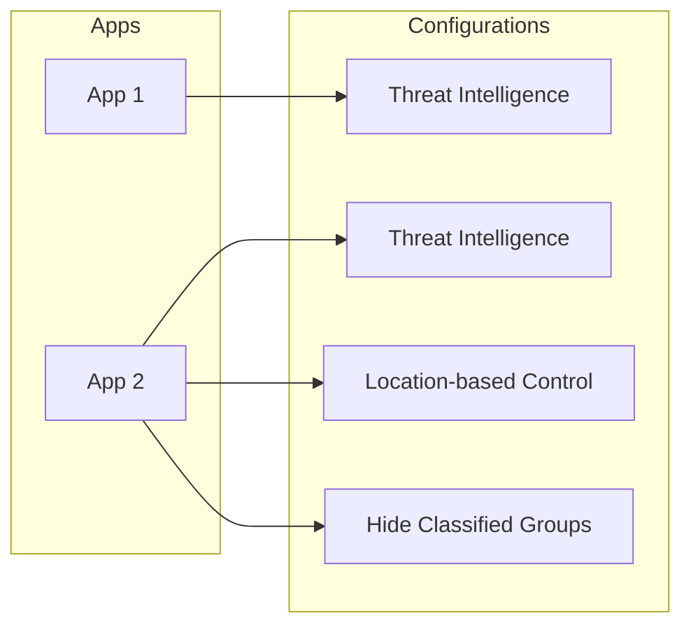

# Use Policies to Protect your Microsoft 365 Environment
> GraphShield helps you to protect you Microsoft 365 environment though easy-to-configure but powerful policies.

## Policies and Rules
At its core, GraphShield provides a set of policies, each policy beeing comprised of one or more rules. In that sense, policies could be seen as a category of rules, useful to navigate rules in a logical manner.

For instance:

## Rules Configurations
Rules could be enabled or disabled individually, and have a specific configuration for each app.

For instance:

